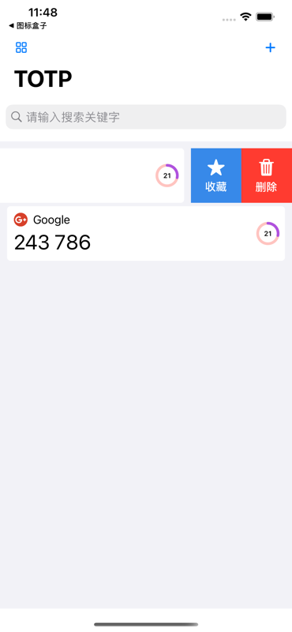

# OTPAuthenticator

  
  <h1>OTPAuthenticator</h1>
   
  
OTPAuthenticator,  用来存储OTP一次性密码的一款安全、简洁、方便、美观的身份验证器。

>  OTPAuthenticator 验证器是从结合[奇密](https://apps.apple.com/cn/app/fantasypass-ikeepass/id1357961740)里面的OTP验证器来用SwiftUI进行重新编写的一款软件，软件全部采用SwiftUI编写。 简洁实用，无需联网，配合我的另外一块APP[图标盒子](https://apps.apple.com/cn/app/%E5%9B%BE%E6%A0%87%E7%9B%92%E5%AD%90/id1540393172)，可以实现图标的自定义，并且无需联网的安全、美观的目的。 欢迎大家使用。

## 效果展示

